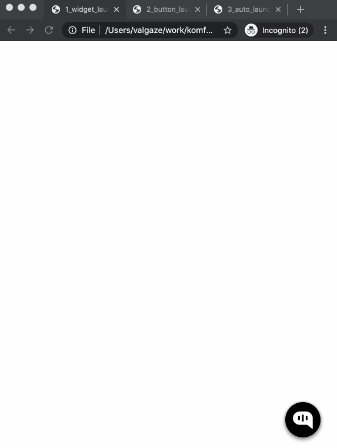
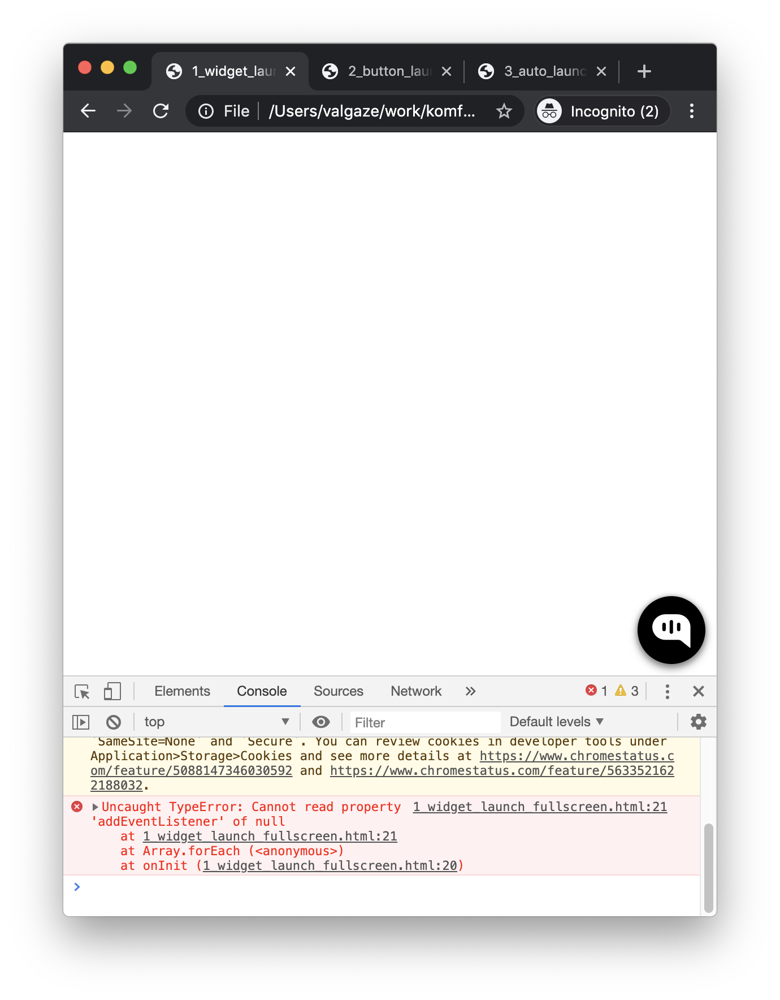
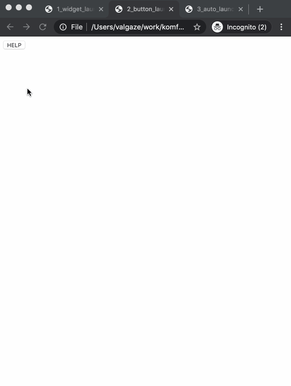
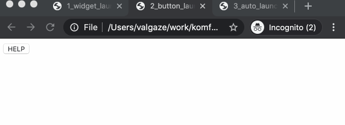
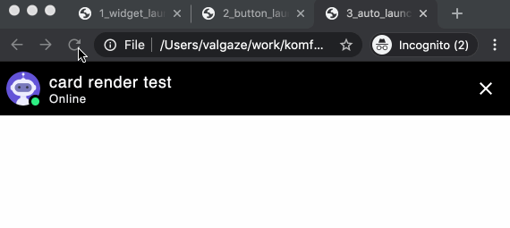
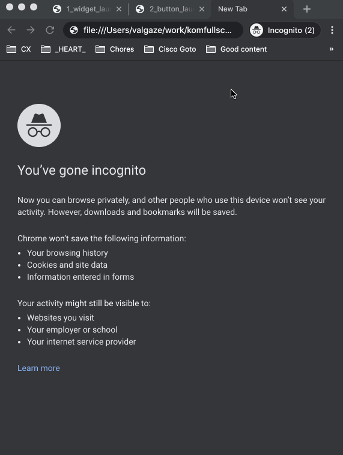

# komfullscreen

Three proof-of-concept experiments for launching chat widget full in its container ((1) from "external" button, (2) automatically on widget init, and (3) from the "normal" widget tap.) These samples were inspired from https://github.com/Kommunicate-io/Kommunicate-Web-SDK & advice/guidance from subject matter experts

* **Goal:** Be able to programmatically launch Kommunicate widget in "fullscreen" without any glitchy visual behavior

* **IMPORANT** In each sample, replace "<<APP_ID_HERE>>>" with the appId of a Kommunicate instance


## [1_widget_launch_fullscreen.html](./1_widget_launch_fullscreen.html)


* **Description:**
    * *This is largely unmodified from advice & example repo, tap Kommunicate widget and launch to fullscreen*

* **Issues:**

    * There is a bug in console (having to do with ```preChatPopup``` element not mounted (see line 20), removed in other examples without any trouble)

* **Screenshots:**

    * **Normal Behavior**

        

    * **Buggy/glitchy Behavior**

        


## 2) [2_button_launch_fullscreen.html](./2_button_launch_fullscreen.html)

Scenario: 

* **Description:**
    * *This was recommended by a subject matter expert. Press a "external" button to launch launch interface in fullscreen*

* **Issues:**

    * Header issue: Top bar has quickly cycles different conversations and loads bot on 1st load (see gif below)

* **Screenshots:**

    * **Normal Behavior**

        

    * **Buggy/glitchy Behavior**

        


## 3) [3_auto_launch_fullscreen.html](./3_auto_launch_fullscreen.html)

* **Description:**
    * *This is the "holy grail"-- on init/load, launch the widget in full screen mode*

* **Issues:**

    * Header issue: Like 2, this sample has glitchy header behavior on launch

    * Reload (NOT a priority to resolve): On reload, the bot occassionally does not offer a greeting (havne't figured exact flow, might be non-deterministic)


* **Screenshots:**

    * **Normal Behavior**

        

    * **Buggy/glitchy Behavior**

        


        


## Resources & links

* https://docs.kommunicate.io/docs/web-customization

* https://github.com/Kommunicate-io/Kommunicate-Web-SDK

* https://www.kommunicate.io/blog/integrate-dialogflow-angular-js/


